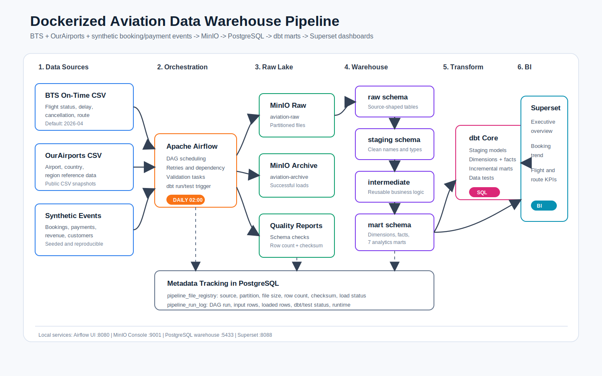
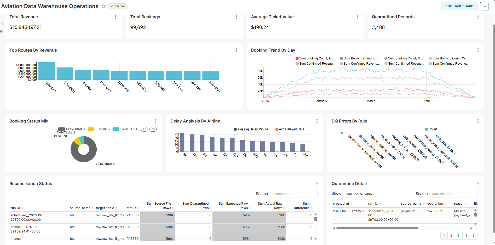
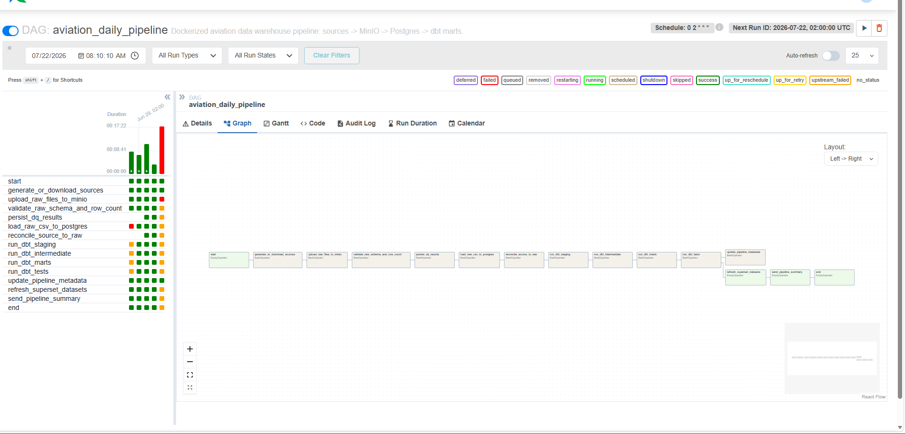
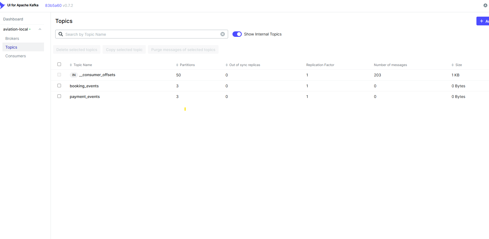
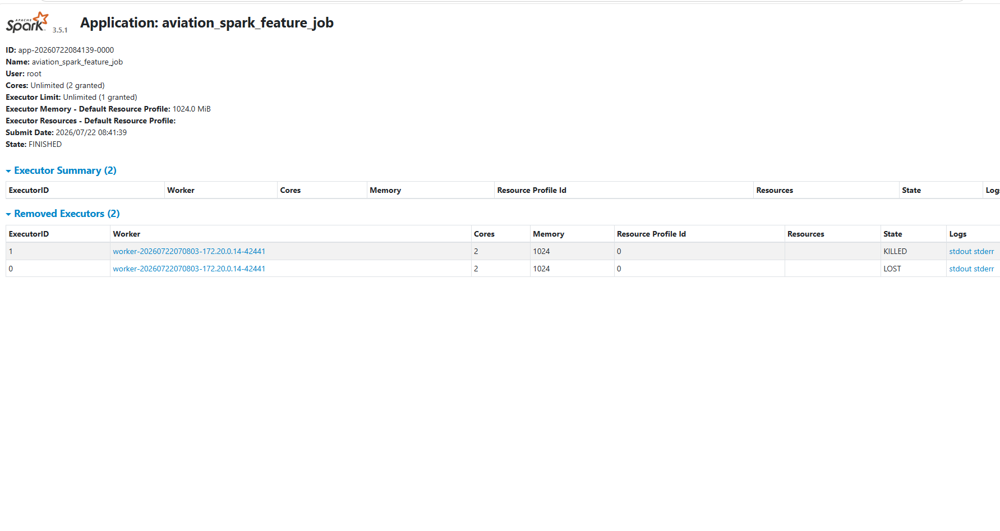
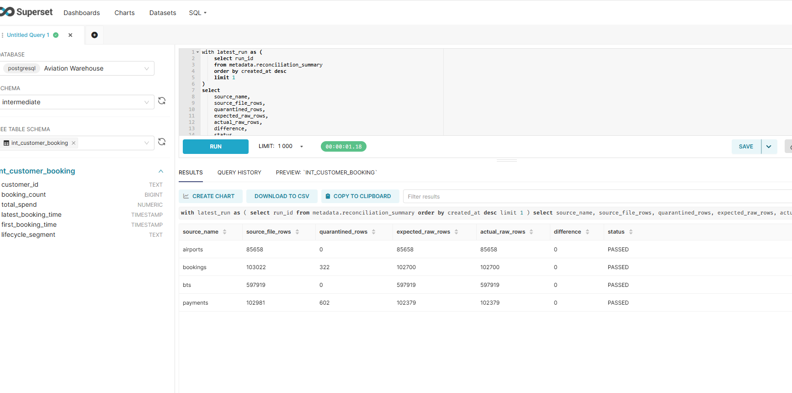

# Dockerized Aviation Data Warehouse Pipeline

Local portfolio project that simulates a cloud-style aviation analytics platform with Airflow, MinIO, Kafka, Spark, PostgreSQL, dbt, and Superset.



## Screenshots

### Dashboard

Superset dashboard over the mart layer, showing KPI cards, route revenue, booking trends, delay analysis, data quality evidence, and reconciliation status.



### Pipeline And Platform

Airflow DAG graph for the batch pipeline:



Kafka UI with booking and payment streaming topics:



Spark master UI with the standalone cluster and submitted Spark application:



### Data Engineering Evidence

MinIO buckets used as S3-style raw and quality storage:


SQL reconciliation evidence used in Superset SQL Lab / PostgreSQL validation:



## What This Builds

- Public flight operations source: BTS Airline On-Time Performance.
- Public reference source: OurAirports airports, countries, and regions.
- Reproducible synthetic business source: bookings and payments linked to real flight routes.
- Optional Kafka streaming sidecar for booking/payment events.
- Intentional dirty data profile for realistic data engineering work: duplicates, casing/spacing issues, status synonyms, missing optional fields, negative values, timestamp ordering issues, and payment mismatches.
- S3-like raw storage in MinIO with partitioned object keys.
- Spark standalone cluster for large CSV feature processing and route-level aggregates.
- PostgreSQL warehouse with raw, staging, intermediate, mart, and metadata schemas.
- dbt transformations for dimensions, facts, and 7 analytics marts.
- Airflow orchestration with retries, validation, raw load, dbt run/test, and metadata tracking.
- Custom Airflow image with dependencies baked in for stable local runtime.
- Kafka producer/consumer demo with idempotent event landing, DLQ, and streaming reconciliation.
- Superset-ready marts for aviation sales, booking, route, airport, customer, and delay dashboards.
- Production-style DQ controls: required-column checks, record-level error logging, quarantine, reconciliation, CDC-style dedupe, and idempotent file loads.

## Repository Layout

```text
airflow/dags/                  Airflow DAGs
data/input/                    Downloaded public source data
data/generated/                Synthetic bookings and payments
data/quality_reports/          Validation output
dbt/                           dbt project and tests
ingestion/                     Download, generate, validate, upload, load scripts
streaming/                     Kafka producer, consumer, and streaming reconciliation scripts
spark/jobs/                    PySpark feature engineering jobs
sql/                           Demo and validation queries for interviews
warehouse/                     PostgreSQL init SQL
superset/                      Dashboard exports and screenshots
docs/                          Architecture and portfolio documentation
```

## Data Sources

| Source | Type | Purpose |
| --- | --- | --- |
| BTS Airline On-Time Performance | Public flight operations | Flight status, delay, cancellation, route performance |
| OurAirports CSV | Public reference data | Airport, country, region dimensions |
| Synthetic Booking Generator | Reproducible generated data | Booking, payment, revenue, customer segment analytics |

Configured URLs are in `.env.example`.

## Data Quality And Cleaning Flow

Raw data is intentionally not perfectly clean. The pipeline keeps the dirty records in `raw.*`, then dbt staging models standardize and deduplicate them before facts and marts are built.

Examples currently generated:

- Duplicate booking/payment events for late-arriving updates.
- Mixed case and padded values: `paid`, ` SUCCESS `, `mobile app`, ` jfk `.
- Business synonyms: `CONF`, `Booked`, `VOID`, `DECLINED`, `CHARGEBACK`.
- Missing optional customer IDs, normalized to `UNKNOWN_CUSTOMER`.
- Negative ticket values, corrected with `abs(ticket_price)` in staging.
- Out-of-order `updated_at`, corrected with `greatest(updated_at, created_at)`.
- Airport code suffix noise like `JFK-T1`, normalized back to `JFK`.

The validation report at `data/quality_reports/validation_report.json` includes a `quality_profile` section with counts for these issues.

Production-like controls are documented in [docs/data_quality.md](docs/data_quality.md):

- Required-column checks.
- Controlled vocabulary standardization.
- Record-level DQ logging instead of silent drops.
- Quarantine files and `quarantine.invalid_records`.
- Source-to-target reconciliation.
- Idempotent file loads using checksums.
- CDC-style duplicate event handling.
- Incremental partition replace logic for reruns/backfills.

## Quick Start

```bash
cp .env.example .env
docker compose up -d --build
```

Open:

- Airflow: <http://localhost:8080> (`admin` / `admin`)
- MinIO: <http://localhost:9001> (`minioadmin` / `minioadmin`)
- Superset: <http://localhost:8088> (`admin` / `admin`)
- Kafka UI: <http://localhost:8089>
- Spark Master UI: <http://localhost:8081>
- Spark Worker UI: <http://localhost:8082>
- Warehouse: `localhost:5433`, database `aviation_dw`, user `aviation`, password `aviation`

Trigger `aviation_daily_pipeline` from Airflow. The DAG downloads sources, generates synthetic data, uploads raw objects to MinIO, validates files, loads raw tables, runs dbt, tests data quality, and writes metadata.

For Kafka streaming mode, trigger `aviation_streaming_demo`. The DAG produces booking/payment events to Kafka, consumes them into raw stream tables, and writes streaming reconciliation metadata.

For Spark feature processing, run `spark/jobs/aviation_feature_job.py` with `spark-submit` to create `mart.spark_route_delay_features`, `mart.spark_route_booking_features`, and `metadata.spark_job_audit`.

Bootstrap Superset assets after the DAG/dbt run succeeds:

```powershell
Get-Content superset/setup_assets.py | docker compose exec -T superset python -
```

Then open the `Aviation Data Warehouse Operations` dashboard in Superset.

Run interview/demo SQL checks:

```powershell
Get-Content sql/demo_queries.sql | docker compose exec -T postgres-warehouse psql -U aviation -d aviation_dw
```

See [docs/evidence_checklist.md](docs/evidence_checklist.md) for screenshots and proof points to capture.
See [docs/project_walkthrough.md](docs/project_walkthrough.md) for the portfolio/interview narrative.
See [docs/streaming_architecture.md](docs/streaming_architecture.md) for the Kafka sidecar demo.
See [docs/giai_thich_du_lieu.md](docs/giai_thich_du_lieu.md) for a Vietnamese explanation of the data.
See [docs/spark_processing.md](docs/spark_processing.md) for the Spark feature processing layer.
See [docs/cv_metrics.md](docs/cv_metrics.md) for quantified CV bullets and verified project metrics.

Manual dbt commands:

```bash
docker compose exec dbt dbt run
docker compose exec dbt dbt test
docker compose exec dbt dbt docs generate
```

## Warehouse Layers

| Layer | Examples |
| --- | --- |
| Raw | `raw_bts_flights`, `raw_airports`, `raw_bookings`, `raw_payments`, `raw_booking_events_stream`, `raw_payment_events_stream` |
| Staging | `stg_flights`, `stg_airports`, `stg_bookings`, `stg_payments` |
| Intermediate | `int_route_daily`, `int_flight_booking_bridge`, `int_customer_booking` |
| Dimensions | `dim_airport`, `dim_airline`, `dim_route`, `dim_customer`, `dim_date` |
| Facts | `fact_flight_status`, `fact_booking`, `fact_payment` |
| Marts | 7 dashboard-facing mart tables plus Spark feature tables |
| Metadata | `pipeline_file_registry`, `pipeline_run_log`, `raw_load_audit`, `dq_record_errors`, `streaming_reconciliation`, `spark_job_audit` |

## Seven Marts

- `mart_sales_performance`
- `mart_booking_status_realtime`
- `mart_booking_trend_daily`
- `mart_route_performance`
- `mart_airport_performance`
- `mart_customer_segment`
- `mart_flight_delay_analysis`

## Spark Feature Tables

- `mart.spark_route_delay_features`
- `mart.spark_route_booking_features`
- `metadata.spark_job_audit`

## Honesty Note

Booking and payment data is synthetic because real airline commercial booking data is not generally public and may contain private or commercially sensitive information. This project is a Dockerized simulation of a cloud-style aviation data warehouse, not a claim of AWS deployment.
